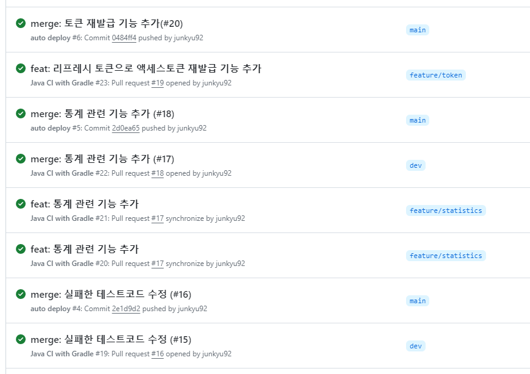
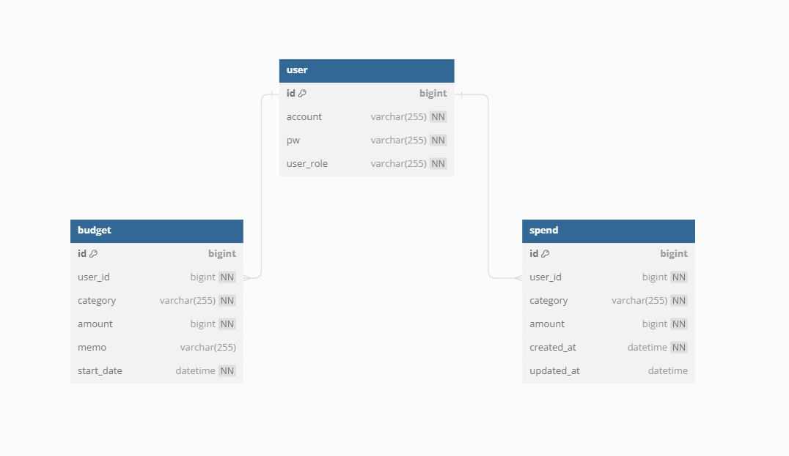

# 예산 관리 어플리케이션 Budget Buddy


## 목차
- [개요](#개요)
- [프로젝트 일정](#프로젝트-일정)
- [사용기술](#사용기술)
- [API 문서](#API-문서)
- [구현 기능](#구현기능)
- [시스템 구성도](#시스템-구성도)
- [ERD](#ERD)
- [TIL 및 회고](#프로젝트-관리-및-회고)


## 개요

본 서비스는 사용자들이 개인 재무를 관리하고 지출을 추적하는 데 도움을 주는 애플리케이션입니다.<br>
이 앱은 사용자들이 `예산`을 설정하고 `지출`을 모니터링하며 재무 목표를 달성하는 데 도움이 됩니다.


## 프로젝트 일정

[-%23000000.svg?style=for-the-badge&logo=notion&logoColor=white)](https://tidy-guava-c55.notion.site/51f01e3f1c844fc799c3b5e6120e5822?pvs=4)


## 사용기술

#### 개발환경
   
<br>
   
<br>
 
<br>
  

#### 배포환경
 
<br>


#### 문서 관리 도구
[-%23000000.svg?style=for-the-badge&logo=notion&logoColor=white)](https://tidy-guava-c55.notion.site/1c433aebe6224359b084c73d1b3c7863?pvs=4)

## API 문서
<details>
  <summary>Swagger</summary>
    
</details>


| API Type         | Http Method | URL                         | Description |
|------------------|-------------|-----------------------------|------------|
| **User API**     | POST        | `/api/v1/users/token`       | 엑세스토큰 재발급  | 
| **User API**     | POST        | `/api/v1/users/sign-up`     | 회원가입       |
| **User API**     | POST        | `/api/v1/users/sign-in`     | 로그인        |
| **Category API** | GET         | `/api/v1/categories`        | 카테고리 목록    |
| **Budgets API**  | POST        | `/api/v1/budgets`           | 예산 등록      |
| **Budgets API**  | GET         | `/api/v1/budgets`           | 예산 조회      |
| **Budgets API**  | GET         | `/api/v1/budgets/recommend` | 예산 추천      |
| **Spends API**   | POST        | `/api/v1/spends`            | 지출 등록      |
| **Spends API**   | PATCH       | `/api/v1/spends/{spendId}`  | 지출 수정      |
| **Spends API**   | DELETE      | `/api/v1/spends/{spendId}`  | 지출 삭제      |
| **Spends API**   | GET         | `/api/v1/spends`            | 지출 리스트 조회  |
| **Spends API**   | GET         | `/api/v1/spends/{spendId}`  | 지출 상세 조회   |


## 구현기능

<details>
  <summary>CI/CD Pipeline 구축</summary>

- CI
  - Git Actions을 통해 dev브랜치와 main브랜치에 PR 생성시 빌드/테스트를 자동실행합니다.
- CD
  - Git Actions을 통해 main브랜치에 Push 발생 시 자동 배포를 진행합니다.
  - 배포는 다음과 같은 순서로 진행됩니다.
  - 빌드 -> 도커 이미지 생성 -> Container Registry에 이미지 Push -> Server에서 이미지 Pull -> 도커 컨테이너 실행 
- Server
  - Naver Cloud 사용
  - Server: 프로젝트 배포를 위한 우분투 서버 생성 (AWS EC2)
  - Container Registry: Docker Image 저장소 생성 (AWS ECS)
  - Object Storage: 파일 저장소 생성, Container Registry를 사용하려면 필수 생성 (AWS S3)
  - Cloud DB for Redis: Redis서버 생성 (AWS ElasticCache)
  - Cloud DB for MySQL: MySQL서버 생성 (AWS RDS)




</details>

<details>
  <summary>회원 가입</summary>

- account, pw를 받아 회원을 등록합니다.
- pw는 passwordEncoder로 암호화하여 저장합니다.
- Request
  ```
    {
      "account" : "test",
      "pw" : "pw123pw123"
    }
  ```
- Response - 201
</details>

<details>
  <summary>로그인</summary>

- account, pw를 받아 로그인합니다.
- 로그인 성공시 Access Token, Refresh Token을 발급합니다.
- Access Token의 유효기간은 1시간이며 모든 api의 헤더에 포함되어야 합니다.
- Refresh Token의 유효기간은 24시간이며 발급시 Redis에 저장합니다.
- Request
  ```
    {
      "account" : "test",
      "pw" : "pw123pw123"
    }
  ```
- Response - 200
  ```
    {
      "accessToken": "eyJhbGciOiJIUzI1NiJ9.eyJpZCI6IjMwIiwiYWNjb3V..",
      "tokenType" : "Bearer",
      "expireIn" : "2023-11-20",
      "refreshToken": "eyJhbGciOiJIUzI1NiJ9.eyJpZCI6IjMwIiwiaXNzI.."
    }
  ```

</details>

<details>
  <summary>토큰 재발급</summary>

- Refresh Token을 받아 Redis에 저장된 값과 비교한 뒤 토큰을 재발급합니다.
- 토큰 재발급시 Redis에 저장된 기존 리프레시 토큰은 새로 발급된 토큰으로 대체됩니다.
- Request
  ```
    {
      "refreshToken" : "Bearer eyJhbGciOiJIUzI1NiJ9.eyJpZCI6IjMwIiwiaXNzI.."
    }
  ```
- Response - 200
  ```
    {
      "accessToken": "eyJhbGciOiJIUzI1NiJ9.eyJpZCI6IjMwIiwiYWNjb3V..",
      "tokenType" : "Bearer",
      "expireIn" : "2023-11-20",
      "refreshToken": "eyJhbGciOiJIUzI1NiJ9.eyJpZCI6IjMwIiwiaXNzI.."
    }
  ```
</details>

<details>
  <summary>카테고리 리스트 조회 기능</summary>

- 전체 카테고리 리스트를 조회합니다.
- Category Enum의 모든 값을 반환합니다.
- Response - 200
  ```
    {
      "categoryList" : ["식비", "교통비", ..]
    }
  ```
</details>

<details>
  <summary>예산 등록</summary>

- 년, 월, 카테고리, 금액을 받아 저장합니다.
- Request
  ```
    {
      "category" : "식비",
      "year" : 2023,
      "month" : 11,
      "amount" : 500000
    }
  ```
- Response - 201
</details>

<details>
  <summary>예산 조회</summary>

- 년, 월을 입력받아 해당 월의 카테고리 별 예산과 총액을 조회합니다.
- Request
  ```
    {
      "year" : 2023,
      "month" : 11
    }
  ```
- Response - 200
  ```
    {
      "총액" : 1000000,
      "식비" : 500000,
      "교통비" : 100000,
      ...
    }
  ```
</details>

<details>
  <summary>예산 분배 비율 추천</summary>

- 예산 총액을 입력받아 카테고리 별 예산 분배 금액을 추천합니다.
- Request
  ```
    {
      "total" : 1000000
    }
  ```
- Response - 200
  ```
    {
      "식비" : 500000,
      "교통비" : 100000,
      ...
    }
  ```
</details>

<details>
  <summary>지출 등록</summary>

- 지출을 등록합니다.
- Request
  ```
    {
      "category" : "식비",
      "amount" : 10000
    }
  ```
- Response - 201
</details>

<details>
  <summary>지출 수정</summary>

- 지출을 수정합니다.
- Request
  ```
    {
      "category" : "식비",
      "amount" : 10000
    }
  ```
- Response - 201
</details>

<details>
  <summary>지출 삭제</summary>

- 지출을 삭제합니다.
- Response - 204
</details>

<details>
  <summary>지출 목록 조회</summary>

- 입력받은 달의 카테고리별 지출과 총액을 조회합니다.
- Request
  ```
    {
      "year" : 2023,
      "month" : 11
    }
  ```
- Response - 200
  ```
    {
      "총액" : 1000000,
      "식비" : 500000,
      "교통비" : 100000,
      ...
    }
  ```
</details>

<details>
  <summary>지출 상세 조회</summary>

- 지출의 상세정보를 조회합니다.
- Response - 200
  ```
    {
      "category" : "식비",
      "amount" : 10000,
      "memo" : "돈까스"
    }
  ```
</details>

<details>
  <summary>지난 달 대비 소비율 조회</summary>

- 지난 달 대비 총액, 카테고리 별 소비율을 제공합니다.
- 오늘이 10일차 라면, 지난달 10일차 까지의 데이터를 대상으로 비교합니다.
- 반환된 숫자는 지난 달 대비 소비율(%)입니다.
- 아래 예시의 경우 이번 달 지출은 지난 달의 94%입니다.
- Response - 200
  ```
    {
      "총액" : 94,
      "식비" : 97,
      "교통비" : 84,
      ...
    }
  ```
</details>

<details>
  <summary>지난 요일 대비 소비율 조회</summary>

- 지난 요일 대비 총액, 카테고리 별 소비율을 제공합니다.
- 오늘이 월요일이라면, 지난주 월요일의 데이터를 대상으로 비교합니다.
- 반환된 숫자는 지난 요일 대비 소비율(%)입니다.
- 아래 예시의 경우 오늘 지출은 지난 요일의 94%입니다.
- Response - 200
  ```
    {
      "총액" : 94,
      "식비" : 97,
      "교통비" : 84,
      ...
    }
  ```
</details>

<details>
  <summary>타 유저 대비 소비율 조회</summary>

- 타 유저 대비 총액, 카테고리 별 소비율을 제공합니다.
- 타 유저의 데이터를 대상으로 비교합니다.
- 반환된 숫자는 타 유저 대비 소비율(%)입니다.
- 아래 예시의 경우 오늘 지출은 타 유저에 비해 94%입니다.
- Response - 200
  ```
    {
      "총액" : 94,
      "식비" : 97,
      "교통비" : 84,
      ...
    }
  ```
</details>

## 시스템 구성도


## ERD


## TIL 및 회고
- 처음으로 혼자 CI/CD Pipeline 구축부터 개발까지 전부 진행해 본 프로젝트였다. 작업 속도는 팀 프로젝트에 비해 훨씬 빨랐지만 
팀원들과 회의를 하고 PR도 받으며 진행했던 프로젝트에 비해서는 확실히 놓치는 부분이 좀 있었던 것 같다.
- 매번 프로젝트를 새로 시작할 때마다 써보지 않은 기술을 하나씩 적용해보려고 노력한다.
여태까지 모든 프로젝트에서 AWS를 사용해 배포했기 때문에 이번 프로젝트에서는 Naver Cloud를 사용해서 배포를 해보기로 했다. AWS를 이미 경험해 보았기 때문인지 Naver Cloud 도입은 수월하게 진행됐다. 
콘솔이 AWS에 비해 사용하기 편하게 잘 되어있었고 한글이라 사용법도 금방 익힐 수 있었다.
추가로 Jenkins를 통해 구현해왔던 자동배포 부분을 이번에는 Git Actions을 통해 구현했다.
구현 과정이 훨씬 간단했고 작동은 잘 되게 구현됐지만 속도가 너무 느려서 굉장히 답답했다. 다음부터는 다시 Jenkins로 돌아가는 걸로..


<details>
  <summary>단순 이름만 저장하는 카테고리를 DB에 저장해야 할까?</summary>

- 설계시에는 해당 프로젝트에서는 카테고리를 테이블로 관리하는 이점이 크지 않을 것으로 생각해 
enum으로 관리하고 원하는 항목이 없을 경우 기타항목에 메모를 통해 표시하도록 설계하였다.
- 카테고리 테이블을 생성하여 DB에서 관리한다면 다음과 같은 이점을 얻을 수 있다.
- 확장성
  - 추후 카테고리 추가, 삭제 등 관리 기능을 만들어 사용할 수 있다.
- 쿼리 성능 향상
  - 조회 api들의 쿼리에서 GROUP BY절에 카테고리를 많이 사용하기 때문에 카테고리를 키로 잡으면 쿼리 성능이 좋아질 것으로 예상한다.
</details>

<details>
  <summary>통계용 테이블을 만들어야 할까?</summary>

- 통계 기능 구현시 두 가지 방법 중 고민이 있었다.
  1. 기능 실행시마다 조회하여 계산
  2. 통계 테이블을 따로 만들어 하루치 지출은 계산해 놓는다.
- 두 가지 방법 중 전자를 택한 이유
  - 통계 테이블을 따로 생성할 시 데이터의 정합성이 떨어질 수 있다.
  - 통계 기능 3가지 중 2가지는 하루의 데이터만 가지고 비교를 하므로 속도가 빠르다.
  - 저번 달의 지출과 비교하는 기능에서는 최소 1일에서 최대 31일치의 데이터를 가지고 비교해야 한다. 
  - 하루에 지출10개 * 31일로 가정하여 계산했을 때 310개의 데이터를 계산한다. 데이터의 양이 그리 많지 않기 때문에 1번 방법으로 진행하였다.
</details>
  


